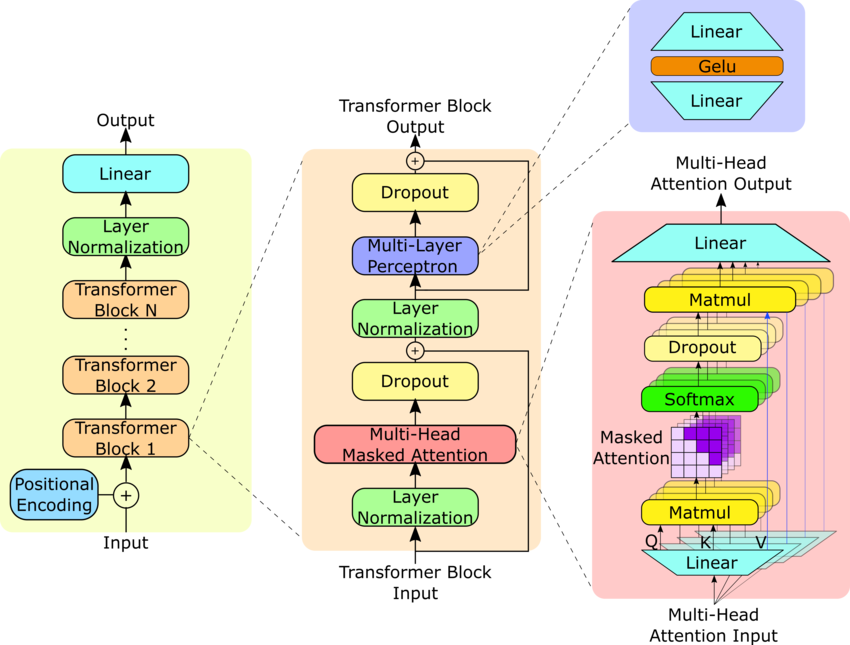

## Paper Name :- Language Models are Unsupervised Multitask Learners
Author :- Alec Radford, Jeffrey Wu, Rewon Child, David Luan, Dario Amodei, Ilya Sutskever

URL - https://cdn.openai.com/better-language-models/language_models_are_unsupervised_multitask_learners.pdf

## GPT-2 model architecture
